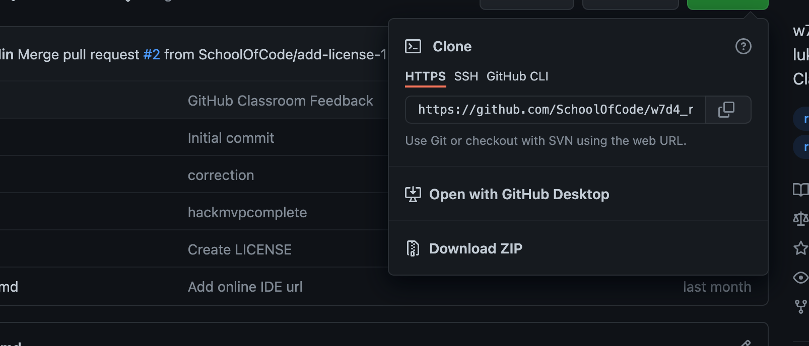

# List App

## Contents

1. Getting started
2. Sections
   1. Components
3. Current Issues

### Getting Started

To open the list app code base, clone down the code base from github, as shown below.
_NB: Code is public_

Link to github: https://github.com/SchoolOfCode/w7d4_react-hackathon-room-36-lilly-luke-andilham

_Remember to install npm i dependencies_

### Sections

The below shows the structure of the list app components and their associated functions.

#### Components

List app

1. Src

2. Standard React JS files where components are called to the DOM (_do not need to alter_)

3. Components

   1. App Where useState for list and text that will be contained within the list are stored and called by the relevant components and functions. _(Also where all components are called and will placed in render section so they appear in the html in the browser)_
   2. Input (Component rendering user input text field and button)
   3. List data - where initial empty array is stored that is used as the basis for populating the list data.
   4. List item - component containing the containing the function that will allow for the each item added to the list to be rendered and also the delete button that will allow for the item to be removed from the list if needed.

4. Public (contains standard React public files and the main index html where the react components will be rendered to)

### Current Issues

N/A
